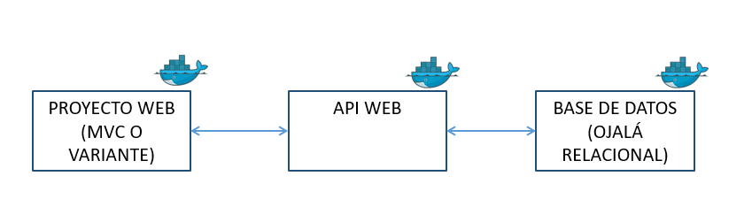

# Aplicación base INF-236  
En este repositorio encontrará un proyecto base que se basa en un CRUD (CREATE, READ, UPDATE, DELETE) sencillo de tareas.  
## Instalaciones necesarias  
* **Docker**: Docker es una plataforma de software que permite a los desarrolladores crear, empaquetar y desplegar aplicaciones en contenedores. Un contenedor es una unidad de software que contiene todo lo necesario para que una aplicación se ejecute, incluyendo el código, las dependencias y las configuraciones del sistema.  
[Link Docker](https://www.docker.com/)  
* **Node**: Es el entorno de ejecución de JavaScript que nos permitirá crear aplicaciones tanto en el lado del backend como en el frontend con JavaScript.  
[Link Node](https://nodejs.org/es/download) 
* **Git**: Es el sistema controlador de versiones más popular utilizado en la actualidad. Nos servirá para poder guardar nuestra aplicación y monitorear los cambios realizados.    
[Link Git](https://git-scm.com/downloads)
* **Postman**: Herramienta utilizada para probar, documentar y compartir API.
## Stack utilizado  
El Stack utilizado esta centrado en NodeJS junto con la base de datos relacional PostgreSQL.   
* Por un lado, estamos utilizando React vite (por temas de rendimiento) en el Front-end, además de las librerías de axios (para la conexión y las peticiones en el backend), y tailwind para el diseño de la aplicación.  
* En el caso de el Backend, se está utilizando el Framework de express, junto con el ORM Sequelize, para realizar las consultas directamente a la base de datos.      
## Estructura del Proyecto

## Documentación  
## Frontend
### [React](https://react.dev/)  
### [Tailwind](https://tailwindcss.com/)  
### [Axios](https://axios-http.com/docs/intro)    
## Backend  
### [Express](https://expressjs.com/es/guide/routing.html)  
### [Sequelize](https://sequelize.org/)    

